# About

This module covers the foundational setup required Apache Spark powered by Cloud Dataproc on GCE.


## Lab Modules

| Module | Resource | 
| -- | :--- |
| 1 | [Foundational Setup](01-foundational-setup.md) |
| 2 | [Create a Spark Cluster](02-gce-create-spark-cluster.md) |
| 3 | [Submit Spark batch jobs](03-run-spark-batch-jobs.md) |
| 4 | [Work with Jupyter notebooks](04-run-spark-notebooks.md) |
| 10 | [Clean up](10-clean-up.md) |


## General Documentation Resources

| Topic | Resource | 
| -- | :--- |
| 1 | [Cloud Dataproc landing page](https://cloud.google.com/dataproc/docs) |
| 2 | [Dataproc Metastore Service](https://cloud.google.com/dataproc-metastore/docs) |
| 3 | [Dataproc Persistent Spark History Server](https://cloud.google.com/dataproc/docs/concepts/jobs/history-server) |
| 4 | [Apache Spark](https://spark.apache.org/docs/latest/) |


## 1.0. Variables

Below, we will define variables used in the module.<br>
Modify as applicable for your environment and run the same in the cloud shell on the [cloud console](https://console.cloud.google.com)-

```
#Any keyword that you can prefix to your resources for traceability and for uniqueness
#for those services that require globally unique names. The Author has used "vajra" for base prefix

BASE_PREFIX="vajra"  

#Replace with your details
ORG_ID=<YOUR_LDAP>.altostrat.com                              
ORG_ID_NBR=<YOUR_ORG_ID_NBR>
ADMINISTRATOR_UPN_FQN=admin@$ORG_ID 
PROJECT_ID=<YOUR_PROJECT_ID>
PROJECT_NBR=<YOUR_PROJECT_ID_NBR>

#Your public IP address, to add to the firewall
YOUR_CIDR=<YOUR_IP_ADDRESS>/32

#General variables
LOCATION=us-central1
ZONE=us-central1-a

UMSA="$BASE_PREFIX-sa"
UMSA_FQN=$UMSA@$PROJECT_ID.iam.gserviceaccount.com

SPARK_GCE_NM=$BASE_PREFIX-gce
PERSISTENT_HISTORY_SERVER_NM=$BASE_PREFIX-sphs

SPARK_GCE_BUCKET=$SPARK_GCE_NM-$PROJECT_ID-s
SPARK_GCE_BUCKET_FQN=gs://$SPARK_GCE_BUCKET
SPARK_GCE_TEMP_BUCKET=$SPARK_GCE_NM-$PROJECT_ID-t
SPARK_GCE_TEMP_BUCKET_FQN=gs://$SPARK_GCE_TEMP_BUCKET
PERSISTENT_HISTORY_SERVER_BUCKET_FQN=gs://$PERSISTENT_HISTORY_SERVER_NM-$PROJECT_NBR


DATAPROC_METASTORE_SERVICE_NM=$BASE_PREFIX-dpms

VPC_PROJ_ID=$PROJECT_ID        
VPC_PROJ_ID=$PROJECT_NBR  

VPC_NM=$BASE_PREFIX-vpc
SPARK_GCE_SUBNET_NM=$SPARK_GCE_NM-snet
SPARK_CATCH_ALL_SUBNET_NM=$BASE_PREFIX-misc-snet

```

## 2.0. Enable APIs

Enable APIs of services in scope for the lab, and their dependencies.<br>
Paste these and run in cloud shell-
```
gcloud services enable dataproc.googleapis.com
gcloud services enable orgpolicy.googleapis.com
gcloud services enable compute.googleapis.com
gcloud services enable container.googleapis.com
gcloud services enable containerregistry.googleapis.com
gcloud services enable bigquery.googleapis.com 
gcloud services enable storage.googleapis.com
gcloud services enable metastore.googleapis.com
```

<br><br>

<hr>

## 2.0. Update Organization Policies

The organization policies include the superset applicable for all flavors of Dataproc, required in Argolis.<br>
Paste these and run in cloud shell-

### 2.a. Relax require OS Login
```
rm os_login.yaml

cat > os_login.yaml << ENDOFFILE
name: projects/${PROJECT_ID}/policies/compute.requireOsLogin
spec:
  rules:
  - enforce: false
ENDOFFILE

gcloud org-policies set-policy os_login.yaml 

rm os_login.yaml
```

### 2.b. Disable Serial Port Logging

```
rm disableSerialPortLogging.yaml

cat > disableSerialPortLogging.yaml << ENDOFFILE
name: projects/${PROJECT_ID}/policies/compute.disableSerialPortLogging
spec:
  rules:
  - enforce: false
ENDOFFILE

gcloud org-policies set-policy disableSerialPortLogging.yaml 

rm disableSerialPortLogging.yaml
```

### 2.c. Disable Shielded VM requirement

```
shieldedVm.yaml 

cat > shieldedVm.yaml << ENDOFFILE
name: projects/$PROJECT_ID/policies/compute.requireShieldedVm
spec:
  rules:
  - enforce: false
ENDOFFILE

gcloud org-policies set-policy shieldedVm.yaml 

rm shieldedVm.yaml 
```

### 2.d. Disable VM can IP forward requirement

```
rm vmCanIpForward.yaml

cat > vmCanIpForward.yaml << ENDOFFILE
name: projects/$PROJECT_ID/policies/compute.vmCanIpForward
spec:
  rules:
  - allowAll: true
ENDOFFILE

gcloud org-policies set-policy vmCanIpForward.yaml

rm vmCanIpForward.yaml
```

### 2.e. Enable VM external access

```
rm vmExternalIpAccess.yaml

cat > vmExternalIpAccess.yaml << ENDOFFILE
name: projects/$PROJECT_ID/policies/compute.vmExternalIpAccess
spec:
  rules:
  - allowAll: true
ENDOFFILE

gcloud org-policies set-policy vmExternalIpAccess.yaml

rm vmExternalIpAccess.yaml
```

### 2.f. Enable restrict VPC peering

```
rm restrictVpcPeering.yaml

cat > restrictVpcPeering.yaml << ENDOFFILE
name: projects/$PROJECT_ID/policies/compute.restrictVpcPeering
spec:
  rules:
  - allowAll: true
ENDOFFILE

gcloud org-policies set-policy restrictVpcPeering.yaml

rm restrictVpcPeering.yaml
```

<br><br>

<hr>

## 3.0. Create a User Managed Service Account (UMSA) & grant it requisite permissions

The User Managed Service Account (UMSA) is to avoid using default Google Managed Service Accounts where supported for tighter security and control.<br>
Paste these and run in cloud shell-

### 3.a. Create UMSA
```
gcloud iam service-accounts create ${UMSA} \
    --description="User Managed Service Account for the $BASE_PREFIX Service Project" \
    --display-name=$UMSA 
```
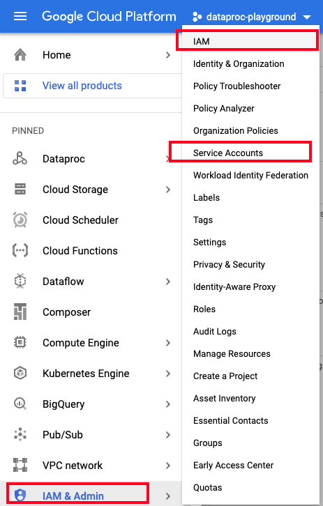   
  
<br><br>

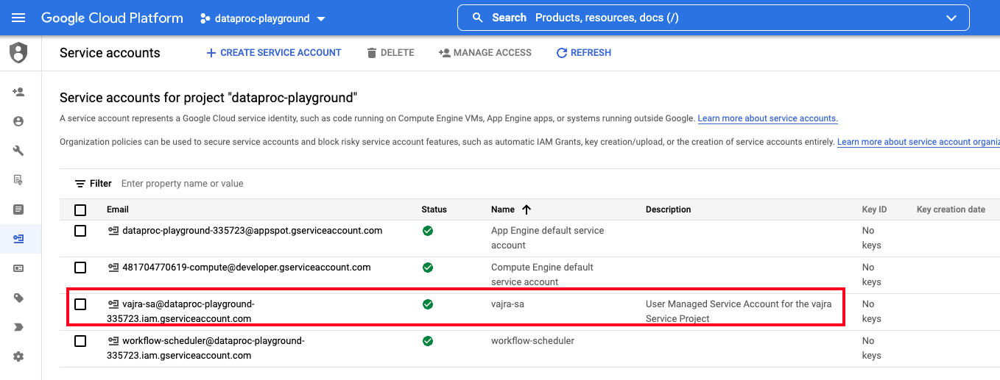   
  
<br><br>

### 3.b. Grant IAM permissions for the UMSA

```
gcloud projects add-iam-policy-binding ${PROJECT_ID} \
    --member=serviceAccount:${UMSA_FQN} \
    --role=roles/iam.serviceAccountUser
    
gcloud projects add-iam-policy-binding ${PROJECT_ID} \
    --member=serviceAccount:${UMSA_FQN} \
    --role=roles/iam.serviceAccountTokenCreator 
    
gcloud projects add-iam-policy-binding $PROJECT_ID --member=serviceAccount:$UMSA_FQN \
--role="roles/bigquery.dataEditor"


gcloud projects add-iam-policy-binding $PROJECT_ID --member=serviceAccount:$UMSA_FQN \
--role="roles/bigquery.admin"

gcloud projects add-iam-policy-binding $PROJECT_ID --member=serviceAccount:$UMSA_FQN \
--role="roles/dataproc.worker"

gcloud projects add-iam-policy-binding $PROJECT_ID --member=serviceAccount:$UMSA_FQN \
--role="roles/metastore.admin"

gcloud projects add-iam-policy-binding $PROJECT_ID --member=serviceAccount:$UMSA_FQN \
--role="roles/metastore.editor"

gcloud projects add-iam-policy-binding $PROJECT_ID --member serviceAccount:$UMSA_FQN \
--role "roles/metastore.serviceAgent" 

gcloud projects add-iam-policy-binding $PROJECT_ID --member=serviceAccount:$UMSA_FQN \
--role="roles/storage.objectCreator"

gcloud projects add-iam-policy-binding $PROJECT_ID --member=serviceAccount:$UMSA_FQN \
--role="roles/dataproc.admin"

```


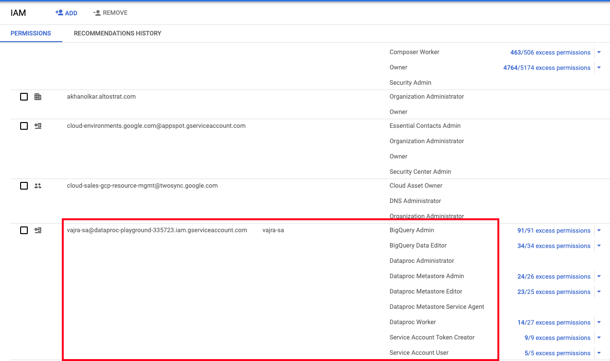   
  
<br><br>

### 3.c. Grant permissions for the lab attendee (yourself)
Paste these and run in cloud shell-
```
gcloud iam service-accounts add-iam-policy-binding \
    ${UMSA_FQN} \
    --member="user:${ADMINISTRATOR_UPN_FQN}" \
    --role="roles/iam.serviceAccountUser"
    
gcloud iam service-accounts add-iam-policy-binding \
    ${UMSA_FQN} \
    --member="user:${ADMINISTRATOR_UPN_FQN}" \
    --role="roles/iam.serviceAccountTokenCreator"
    

gcloud projects add-iam-policy-binding $PROJECT_ID --member=user:$ADMINISTRATOR_UPN_FQN \
--role="roles/bigquery.user"

gcloud projects add-iam-policy-binding $PROJECT_ID --member=user:$ADMINISTRATOR_UPN_FQN \
--role="roles/bigquery.dataEditor"

gcloud projects add-iam-policy-binding $PROJECT_ID --member=user:$ADMINISTRATOR_UPN_FQN \
--role="roles/bigquery.jobUser"

gcloud projects add-iam-policy-binding $PROJECT_ID --member=user:$ADMINISTRATOR_UPN_FQN \
--role="roles/bigquery.admin"
```

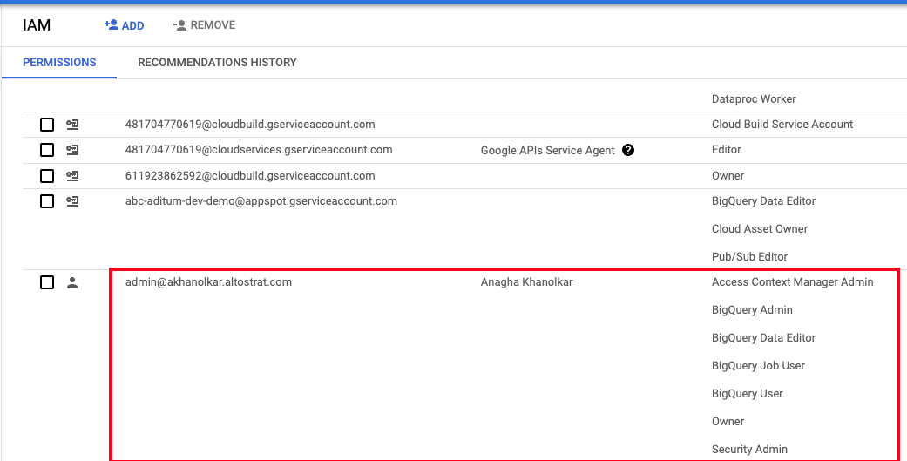   
  
<br><br>

### 3.d. Grant permissions to the Dataproc Service Agent to interact with the Dataproc Metastore
Paste these and run in cloud shell-
```
gcloud projects add-iam-policy-binding $PROJECT_ID --member=serviceAccount:$UMSA_FQN \
--role="roles/metastore.editor"
```

<hr>

## 4.0. Create VPC, Subnets and Firewall Rules

Dataproc is a VPC native service, therefore needs a VPC subnet.<br>
Paste these and run in cloud shell-

## 4.a. Create VPC

```
gcloud compute networks create $VPC_NM \
--project=$PROJECT_ID \
--subnet-mode=custom \
--mtu=1460 \
--bgp-routing-mode=regional
```

<br><br>

## 4.b. Create subnet & firewall rules for Dataproc - GCE

Dataproc serverless Spark needs intra subnet open ingress. <br>
Paste these and run in cloud shell-
```
SPARK_GCE_SUBNET_CIDR=10.0.0.0/16

gcloud compute networks subnets create $SPARK_GCE_SUBNET_NM \
 --network $VPC_NM \
 --range $SPARK_GCE_SUBNET_CIDR  \
 --region $LOCATION \
 --enable-private-ip-google-access \
 --project $PROJECT_ID 
 
gcloud compute --project=$PROJECT_ID firewall-rules create allow-intra-$SPARK_GCE_SUBNET_NM \
--direction=INGRESS \
--priority=1000 \
--network=$VPC_NM \
--action=ALLOW \
--rules=all \
--source-ranges=$SPARK_GCE_SUBNET_CIDR

gcloud compute firewall-rules create allow-ssh-$SPARK_GCE_SUBNET_NM \
--project=$PROJECT_ID \
--network=$VPC_NM \
--direction=INGRESS \
--priority=65534 \
--source-ranges=0.0.0.0/0 \
--action=ALLOW \
--rules=tcp:22

```

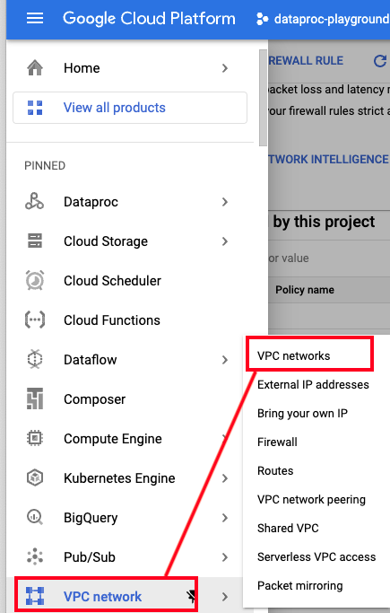   
  
<br><br>

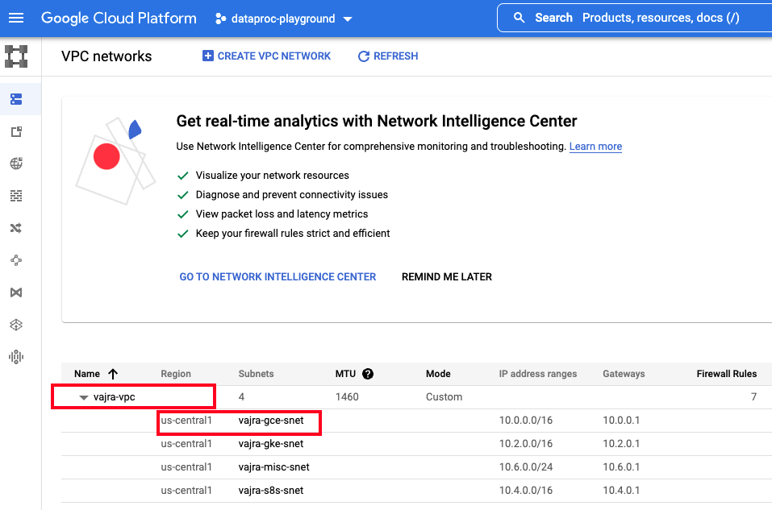   
  
<br><br>

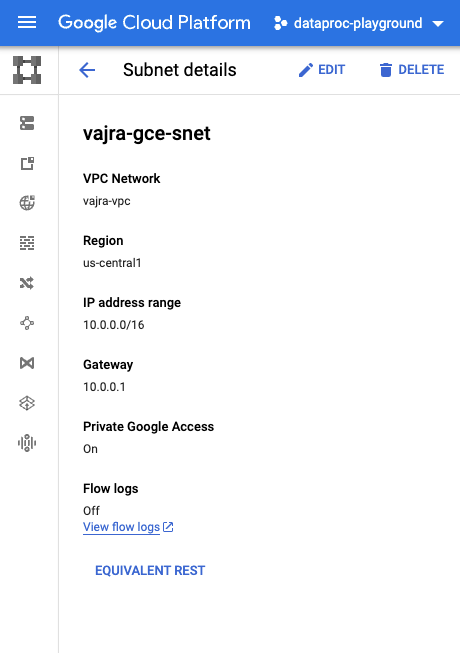   
  
<br><br>

   
  
<br><br>


<br><br>

<hr>

## 4.c. Create subnet & firewall rules for Dataproc - PSHS & DPMS
Further in the lab, we will create a persistent Spark History Server where the logs for serverless Spark jobs can be accessible beyond 24 hours (default without). We will also create a Dataproc Metastore Service for persistent Apache Hive Metastore.<br>
Paste these and run in cloud shell-

```
SPARK_CATCH_ALL_SUBNET_CIDR=10.6.0.0/24

gcloud compute networks subnets create $SPARK_CATCH_ALL_SUBNET_NM \
 --network $VPC_NM \
 --range $SPARK_CATCH_ALL_SUBNET_CIDR \
 --region $LOCATION \
 --enable-private-ip-google-access \
 --project $PROJECT_ID 
 
gcloud compute --project=$PROJECT_ID firewall-rules create allow-intra-$SPARK_CATCH_ALL_SUBNET_NM \
--direction=INGRESS \
--priority=1000 \
--network=$VPC_NM \
--action=ALLOW \
--rules=all \
--source-ranges=$SPARK_CATCH_ALL_SUBNET_CIDR
```

<br><br>

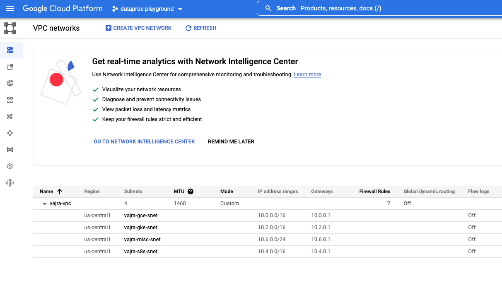   
  
<br><br>

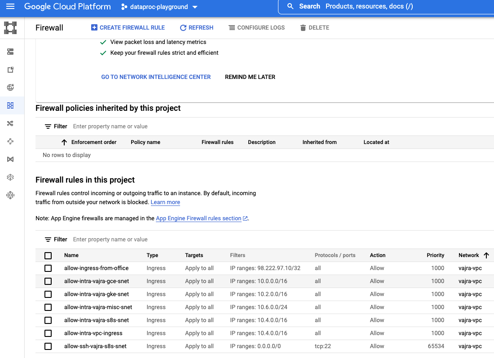   
  
<br><br>

<hr>

### 4.d. Grant access to your IP address

```
gcloud compute firewall-rules create allow-ingress-from-office \
--direction=INGRESS \
--priority=1000 \
--network=$VPC_NM \
--action=ALLOW \
--rules=all \
--source-ranges=$YOUR_CIDR
```
 
<br><br>

<hr>

## 5.0. Create staging buckets for the Spark cluster

These buckets are for clusters to store intermediate data and other operational data.<br>

Run the command below to provision-
```
gsutil mb -p $PROJECT_ID -c STANDARD -l $LOCATION -b on $SPARK_GCE_BUCKET_FQN
gsutil mb -p $PROJECT_ID -c STANDARD -l $LOCATION -b on $SPARK_GCE_TEMP_BUCKET_FQN
```

<br><br>

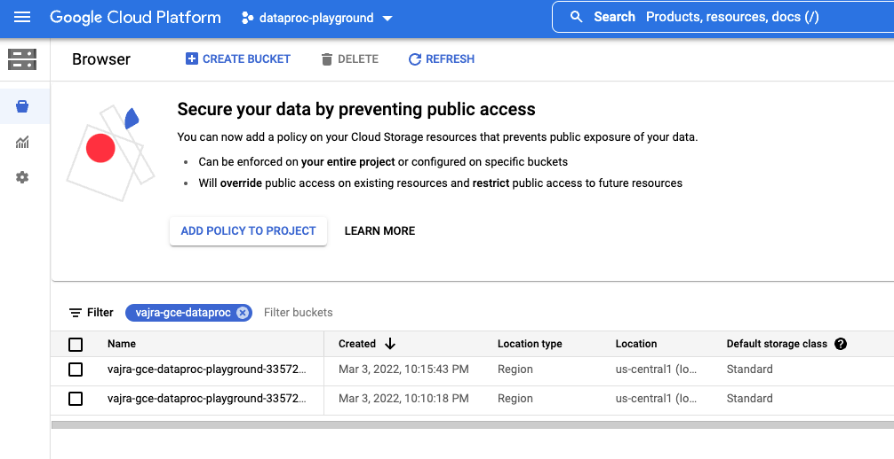   
  
<br><br>

<hr>

## 6.0. Create common Persistent Spark History Server

A common Persistent Spark History Server can be leveraged across clusters and serverless for log persistence/retention and visualization.<br>
Docs: https://cloud.google.com/dataproc/docs/concepts/jobs/history-server<br>

Run the command below to provision-
```
gsutil mb -p $PROJECT_ID -c STANDARD -l $LOCATION -b on $PERSISTENT_HISTORY_SERVER_BUCKET_FQN

gcloud dataproc clusters create $PERSISTENT_HISTORY_SERVER_NM \
    --single-node \
    --region=$LOCATION \
    --image-version=1.4-debian10 \
    --enable-component-gateway \
    --properties="dataproc:job.history.to-gcs.enabled=true,spark:spark.history.fs.logDirectory=$PERSISTENT_HISTORY_SERVER_BUCKET_FQN/*/spark-job-history,mapred:mapreduce.jobhistory.read-only.dir-pattern=$PERSISTENT_HISTORY_SERVER_BUCKET/*/mapreduce-job-history/done" \
    --service-account=$UMSA_FQN \
--single-node \
--subnet=projects/$PROJECT_ID/regions/$LOCATION/subnetworks/$SPARK_CATCH_ALL_SUBNET_NM
```
<br><br>

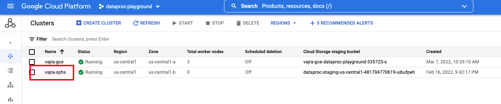   
  
<br><br>

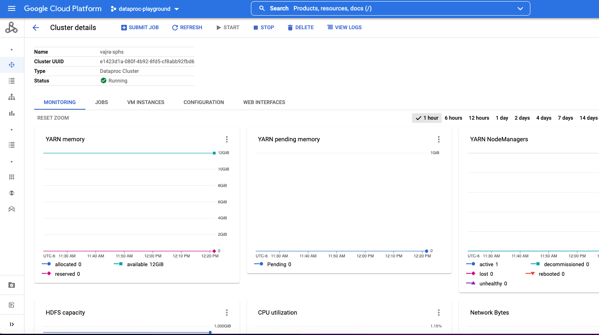   
  
<br><br>

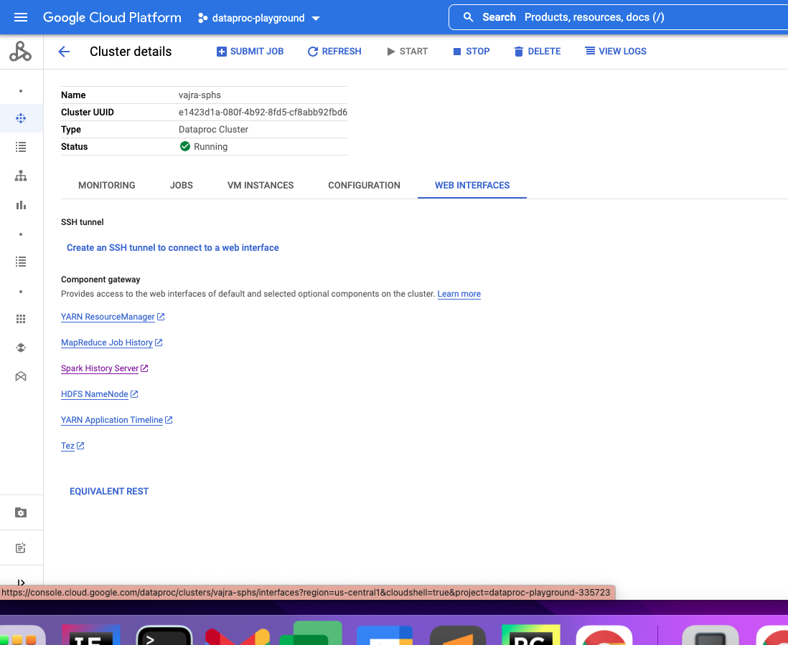   
  
<br><br>


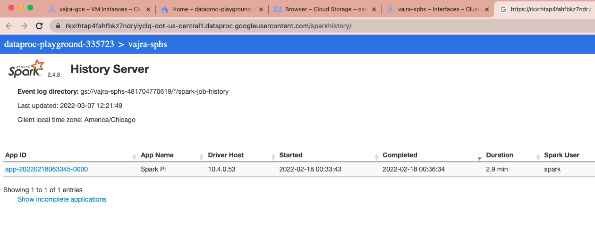   
  
<br><br>


<hr>


## 7.0. Create common Dataproc Metastore Service

A common Dataproc Metastore Service can be leveraged across clusters and serverless for Hive metadata.<br>
This service does not support BYO subnet currently.<br>

Run the command below to provision-
```
gcloud metastore services create $DATAPROC_METASTORE_SERVICE_NM \
    --location=$LOCATION \
    --labels=used-by=all-$BASE_PREFIX-clusters \
    --network=$VPC_NM \
    --port=9083 \
    --tier=Developer \
    --hive-metastore-version=3.1.2 \
    --impersonate-service-account=$UMSA_FQN 
```
<br><br>

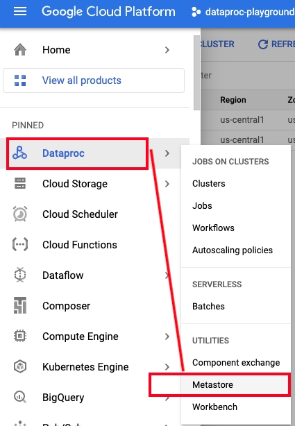   
  
<br><br>

   
  
<br><br>

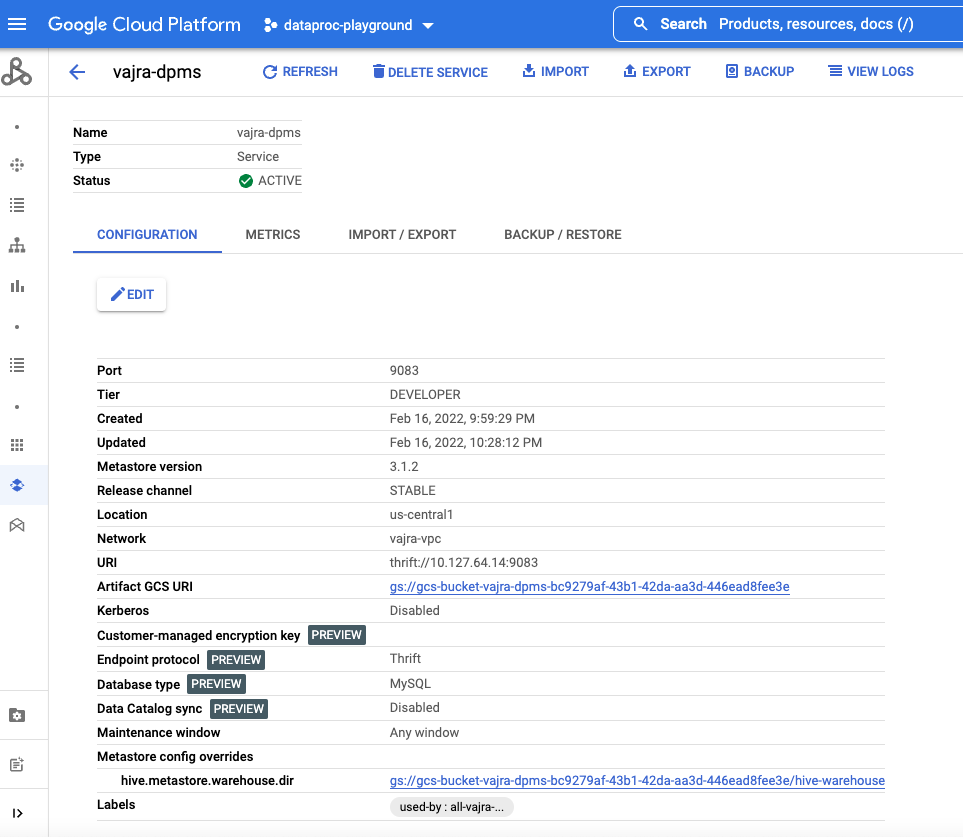   
  
<br><br>

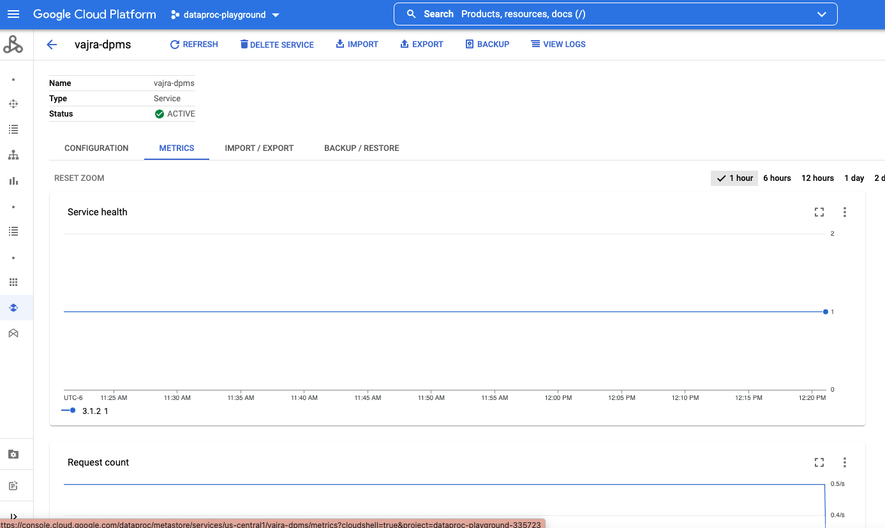   
  
<br><br>

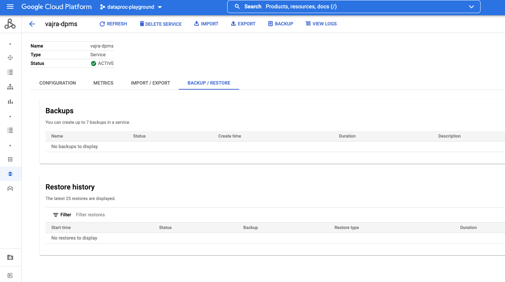   
  
<br><br>

<hr>
This concludes the module. <br>

[Next Module](02-gce-create-spark-cluster.md) 
<br>
[Repo Landing Page](README.md)

<hr>
