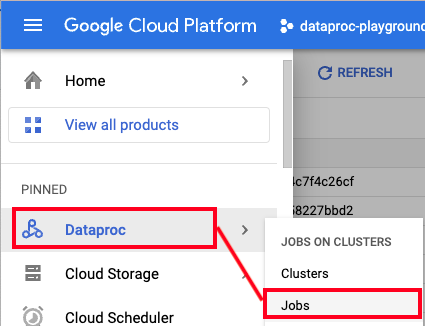
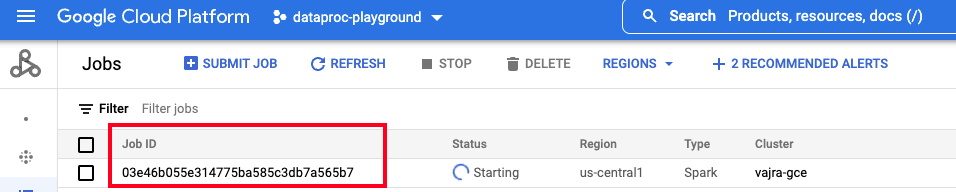
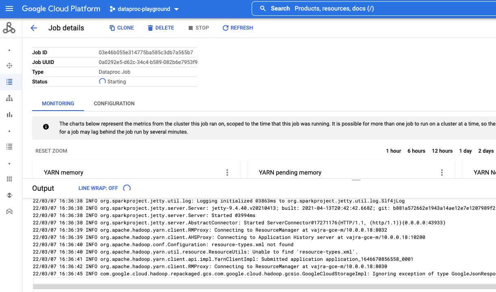
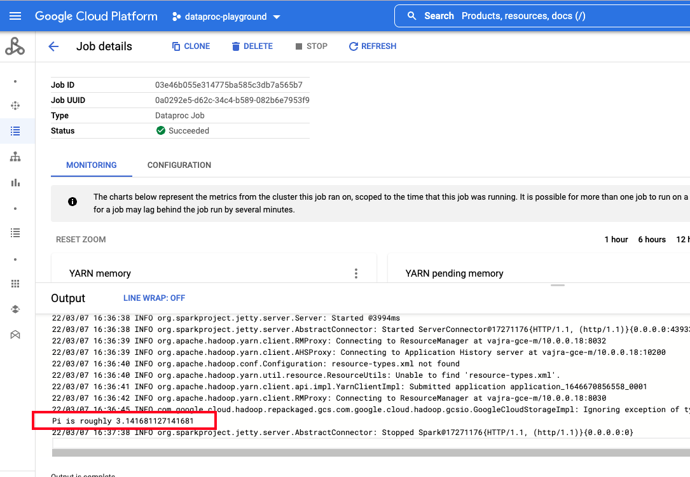
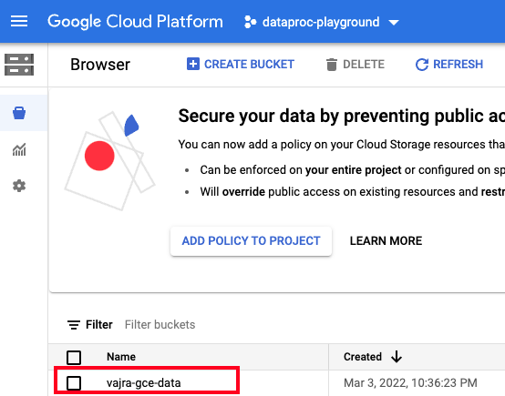
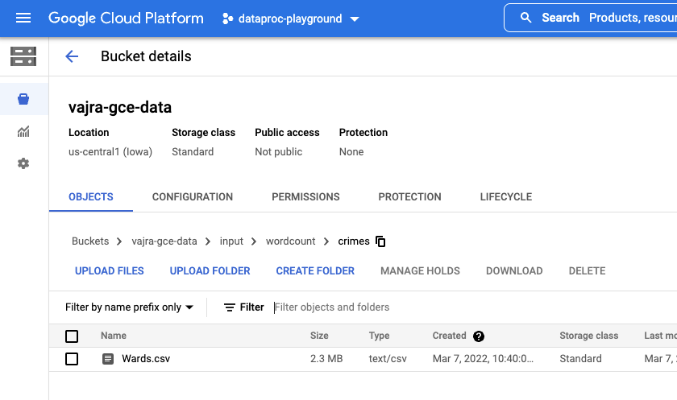
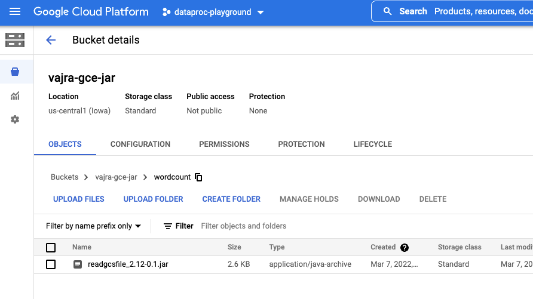
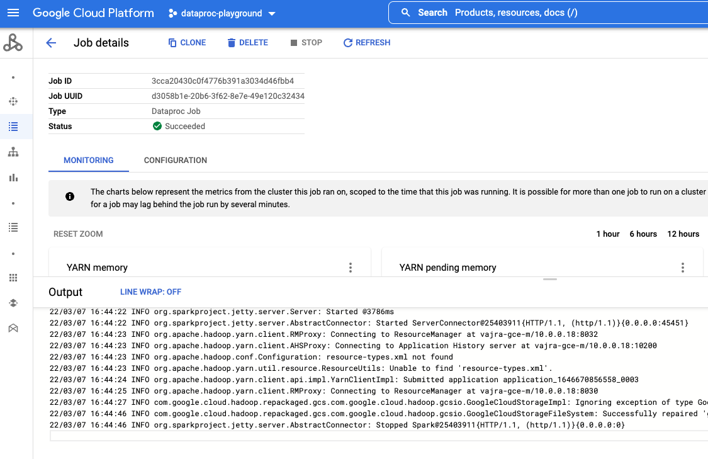
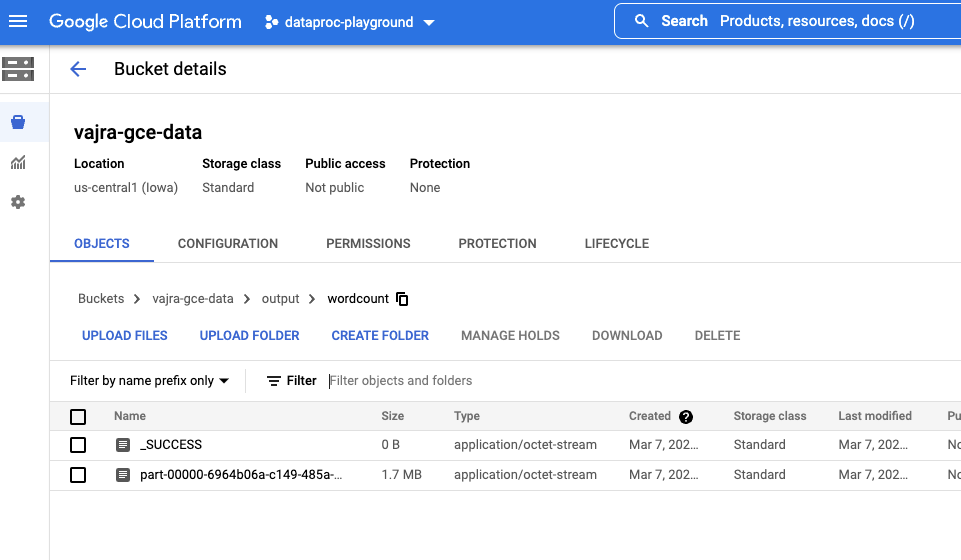

# About

This module shows how to submit Apache Sparks jobs to a pre-created Cloud Dataproc cluster.


## Lab Modules

| Module | Resource | 
| -- | :--- |
| 1 | [Foundational Setup](01-foundational-setup.md) |
| 2 | [Create a Spark Cluster](02-gce-create-spark-cluster.md) |
| 3 | [Submit Spark batch jobs](03-run-spark-batch-jobs.md) |
| 4 | [Spark notebooks](04-run-spark-notebooks.md) |
| 10 | [Clean up](10-clean-up.md) |

<br>

<hr>

## Documentation resources

| Topic | Resource | 
| -- | :--- |
| 1 | [Submitting jobs to a Cloud Dataproc cluster](https://cloud.google.com/dataproc/docs/guides/submit-job) |
| 2 | [Cloud Dataproc landing page](https://cloud.google.com/dataproc/docs) |
| 3 | [Dataproc Metastore Service](https://cloud.google.com/dataproc-metastore/docs) |
| 4 | [Dataproc Persistent Spark History Server](https://cloud.google.com/dataproc/docs/concepts/jobs/history-server) |
| 5 | [Apache Spark](https://spark.apache.org/docs/latest/) |

<br>

<hr>


## 1. Variables

```
#Replace with base prefix you chose in module 1
BASE_PREFIX="vajra"  

#Replace with your details
ORG_ID=<YOUR_LDAP>.altostrat.com                              
ORG_ID_NBR=<YOUR_ORG_ID_NBR>
ADMINISTRATOR_UPN_FQN=admin@$ORG_ID 
PROJECT_ID=$(gcloud config list --format 'value(core.project)')
PROJECT_NBR=<YOUR_PROJECT_ID_NBR>

#Your public IP address, to add to the firewall
YOUR_CIDR=<YOUR_IP_ADDRESS>/32

#General variables
LOCATION=us-central1
ZONE=us-central1-a

UMSA="$BASE_PREFIX-sa"
UMSA_FQN=$UMSA@$PROJECT_ID.iam.gserviceaccount.com

SPARK_GCE_NM=$BASE_PREFIX-gce
DATAPROC_METASTORE_SERVICE_NM=$BASE_PREFIX-dpms
SPARK_GCE_SUBNET_NM=$SPARK_GCE_NM-snet

DATA_BUCKET_FQN=gs://$BASE_PREFIX-gce-data
JAR_BUCKET_FQN=gs://$BASE_PREFIX-gce-jar

JAR_NAME=readgcsfile_2.12-0.1.jar
CLASS_NAME=ReadGCSFileAndWordCount
```
<br>

<hr>

## 2. Run a "SparkPi" job
This job merely calculates the value of Pi and emits the result to the screen and is great for a basic environment setup set.

```
gcloud dataproc jobs submit spark --id "Sparkpi-1" \
--cluster=${SPARK_GCE_NM} \
--region=$LOCATION \
--jars=file:///usr/lib/spark/examples/jars/spark-examples.jar \
--class org.apache.spark.examples.SparkPi -- 10000
```

In the output you should see-
```
Pi is roughly 3.141681127141681
```

Navigate to the Dataproc "batch job" UI on the Cloud Console and explore the batch job UI and logs.

 

<br><br>

 

<br><br>

 

<br><br>

 

<br>

<hr>


## 3. Run a "Wordcount" job

### 3.1. Create storage buckets (one time activity)

#### 3.1.a. Create a bucket for the source file
```
gsutil mb -p $PROJECT_ID -c STANDARD -l $LOCATION -b on $DATA_BUCKET_FQN
```
 

<br><br>

#### 3.1.b. Create a bucket for the "Wordcount" jar (one time activity)
```
gsutil mb -p $PROJECT_ID -c STANDARD -l $LOCATION -b on $JAR_BUCKET_FQN
```

## 3.2. Copy source data and jar for the lab, to the buckets created

### 3.2.a. Clone this git repo via gcloud in Cloud Shell

```
cd ~
git clone https://github.com/anagha-google/spark-on-gcp-gce.git
```

### 3.2.b. Copy the source file to the source bucket

```
cd ~/spark-on-gcp-gce/
gsutil cp data/Wards.csv $DATA_BUCKET_FQN/input/wordcount/crimes/Wards.csv
```

 

<br><br>

### 3.2.c. Copy the jar file to the jar bucket

```
cd ~/spark-on-gcp-gce/
gsutil cp jars/readgcsfile_2.12-0.1.jar $JAR_BUCKET_FQN/wordcount/
```

 

<br><br>

## 3.3. Submit the "Wordcount" job as the service account

```
#Clean up output from potential prior runs
gsutil rm -R $DATA_BUCKET_FQN/output/wordcount 

#Submit job
gcloud dataproc jobs submit spark \
    --cluster=${SPARK_GCE_NM} \
    --class=${CLASS_NAME} \
    --jars=$JAR_BUCKET_FQN/wordcount/readgcsfile_2.12-0.1.jar \
    --region=${LOCATION} \
    --impersonate-service-account $UMSA_FQN \
    -- ${DATA_BUCKET_FQN}/input/wordcount/crimes/Wards.csv ${DATA_BUCKET_FQN}/output/wordcount 
```

1. Navigate to the Dataproc UI, to the "job" GUI and view the execution logs<br>

 

<br><br>

 

<br><br>

 

<br><br>


2. Navigate to the GCS bucket for output and view the files created there. <br>
You can also review the files via gcloud command-
```
gsutil cat `gsutil ls ${DATA_BUCKET_FQN}/output/wordcount | grep part* | head -1` | head -5
```
The result should look something like this-
```
-87.6929601255439,2
-87.69044566500749,2
"41.84205857647401,",2
"41.84030987335775,",2
-87.67775411246915,2
```

<br>

<hr>
This concludes the module. <br>

[Next Module](04-run-spark-notebooks.md) 
<br>
[Repo Landing Page](README.md)

<hr>
